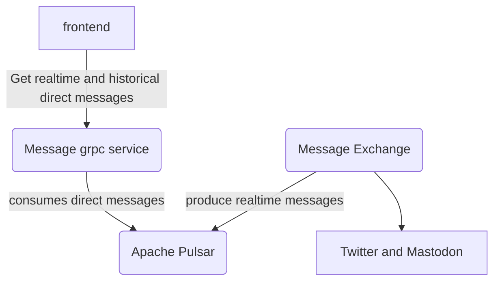

# Message aggregation service

## the services involved in message aggregator are as below:
### The message exchange
This retreives the direct messages from twitter and mastodon. 

### Apache pulsar
Pulsar is a distributed messaging and streaming platform. Pulsar is used as pub sub service for retrieving realtime messages and also get historical messages. 
https://pulsar.apache.org/

### The message grpc service
This grpc microservice is used for exposing endpoints to frontend services that needs to display direct messages from twitter or mastodon. 
